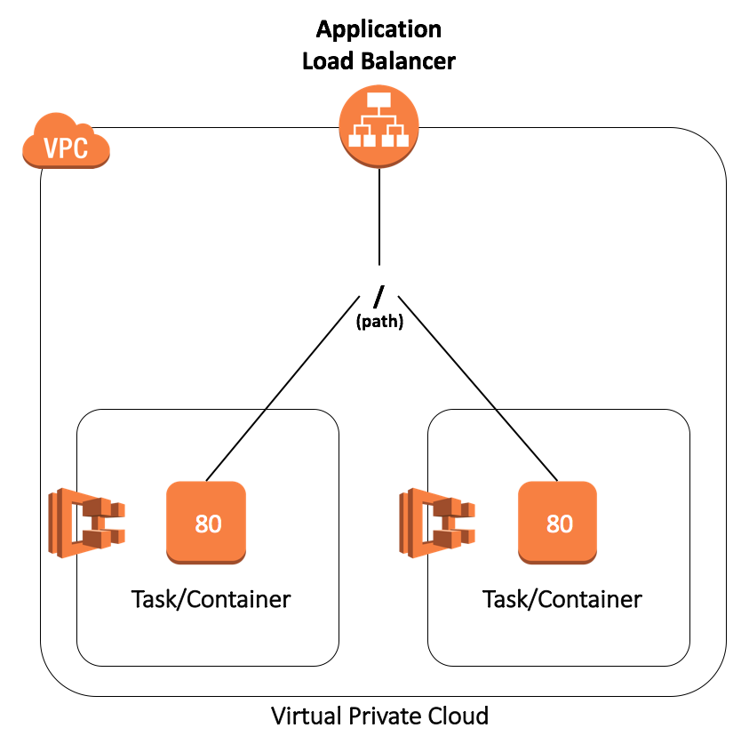
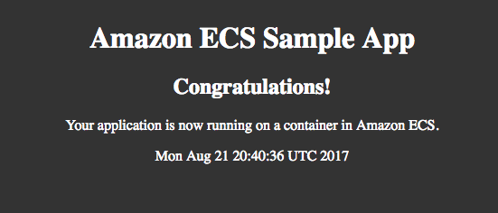
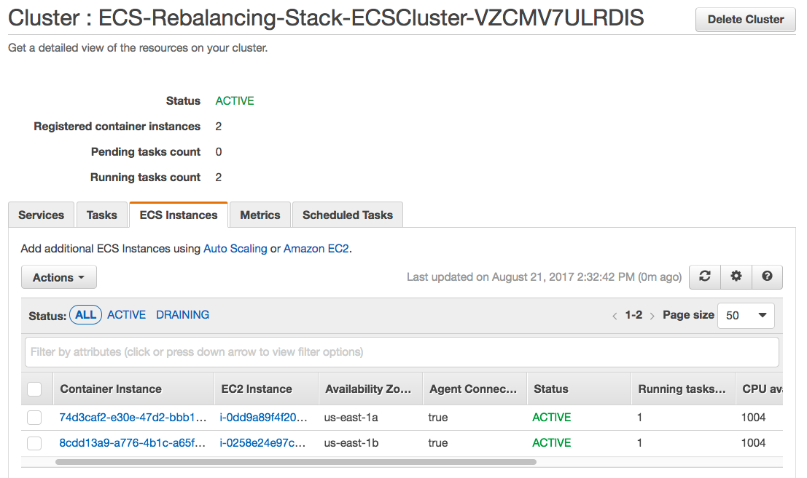
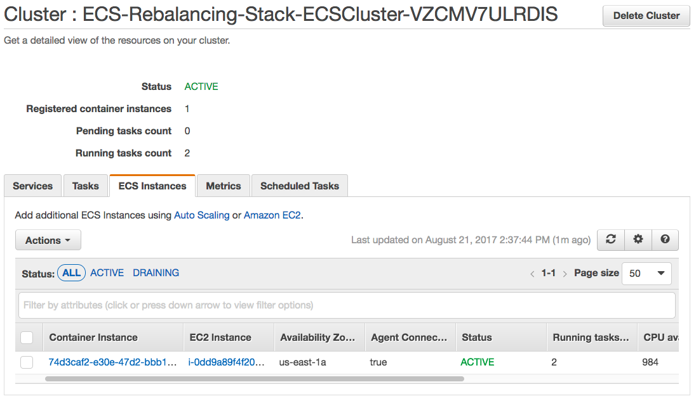
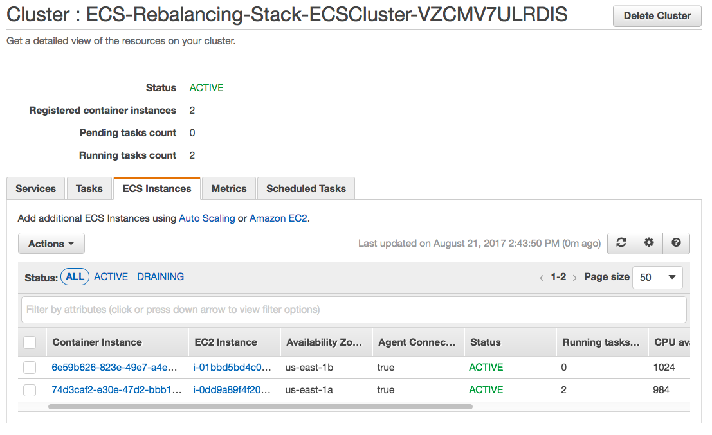
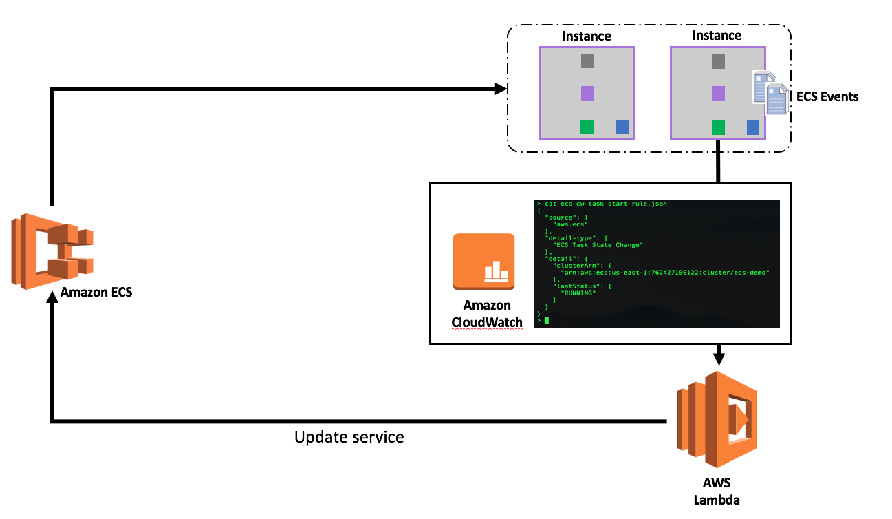
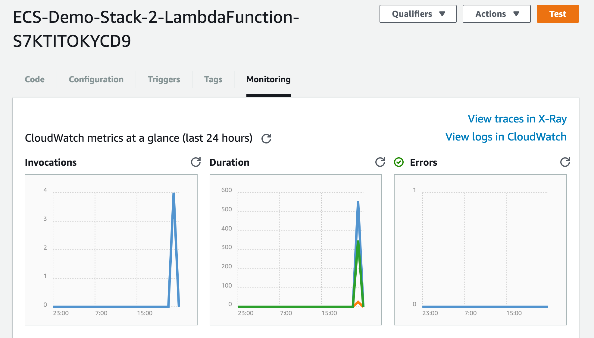
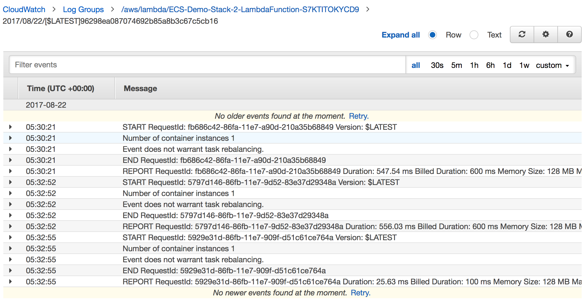
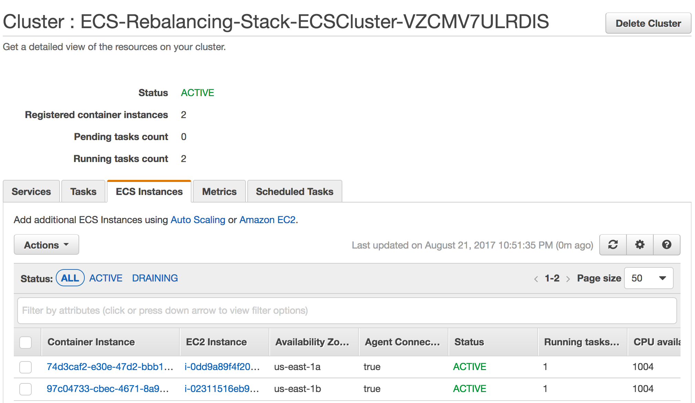
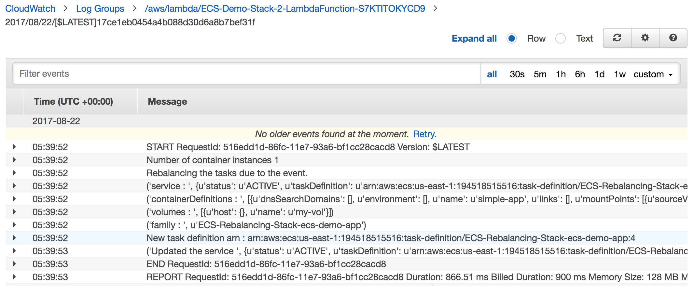

# Rebalancing Amazon ECS Tasks using AWS Lambda

## Introduction 

In this reference architecture, we will demonstrate a serverless approach using AWS Lambda and Amazon ECS Event Stream to proactively rebalance the ECS tasks.

## Create an ECS Cluster and Deploy a Sample App 

For your convenience, we have created a CloudFormation template that will create the core infrastructure that we will use throughout this example. The template creates an Application Load Balancer (ALB), an ECS Cluster containing two m3.medium instances running the ECS Optimized AMI, and a task definition for a small web application. An S3 bucket is also created to host our lambda function.

### Let's Get Started

*	Create a new Stack from the AWS Console use the following template URL: <https://github.com/awslabs/ecs-refarch-task-rebalancing/blob/master/ecs-cluster-setup.yaml>
* Confirm that the stack creates successfully. Under the Outputs tab, you’ll find an S# bucket listed. Note this down as you will use it later to upload your zipped Lambda Function.
* You’ll also find the Application URL listed as ECSALB. Cut and paste this into your browser. 

	**You should see a Congratulations page confirming that your ECS Service is running as expected.**
	


### Explore the ECS Cluster

* Review the configuration in the ECS Console. You should see two ECS Instances and two running tasks. One task should be running on each.

	

*  Scale Down the ECS Cluster Size to **1** using the desired count in the Auto Scaling Group Settings
* Verify that the Site has remained up and both tasks are running on a single node.

	

*	Change the ASG desired count back to **2**
*	Observe that a new instance is created, but tasks did not balance across both nodes. This is the default behavior of ECS.

	

## Use ECS Events to Rebalance Tasks

We propose a solution that listens to “ECS Container Instance State Change” events on the ECS event stream and triggers a lambda that rebalances tasks on the ECS cluster. 



This involves:

* Creating a Lambda function that will rebalance tasks on ECS cluster by updating the service deployed on the cluster.  
* 	Creating a Cloud Watch Event, that uses “ECS Container Instance State Change” event from the ECS event stream as a trigger to execute the lambda function that rebalances the tasks.

### Create and deploy the Lambda Function

* The code for our lambda function is `ecs-task-rebalancer.py` and can be found at <https://github.com/awslabs/ecs-refarch-task-rebalancing/blob/master/ecs-task-rebalancer.py>. Save this file or recreate it locally.
* Zip up the python script
	`zip ecs-task-rebalancer.zip ecs-task-rebalancer.py`
* Upload the zip file to the S3 bucket created by the CloudFormation template using the Console or AWS CLI.
	`aws s3 cp ecs-task-rebalancer.zip s3://<BUCKET_NAME>`
* A second CloudFormation template has been provided to configure the Lambda Function and CloudWatch Triggers. Create a new stack using the following template: <https://github.com/awslabs/ecs-refarch-task-rebalancing/blob/master/ecs-task-rebalancer.json>
* Confirm that the stack is created successfully.

### Scale the Cluster and Validate Task Rebalancing

* Scale Down the ECS Cluster Size to **1** using the desired count in the Auto Scaling Group Settings
* Verify that the Site has remained up and both tasks are running on a single node.
* In the AWS Lambda console, confirm that your lambda function has been triggered and show no invocations

	

* In the CloudWatch Console, you'll see a log group named after your CloudFormation Stack. You'll see the output of the lambda function, but see that tasks did not require rebalancing.

	
	
*	We will now scale the cluster back up. Change the ASG desired count back to **2**
*	In the ECS console, you'll see that the second instance has been restored and the tasks have been balanced across both nodes.

	

6.	Review the CloudWatch logs. You'll see that a new task definition version was created causing the tasks to be rebalanced across all available nodes.

	



