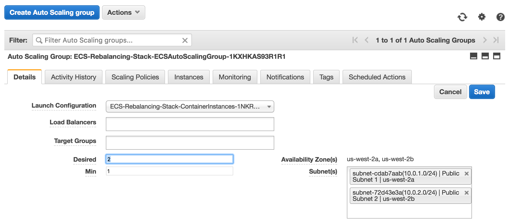
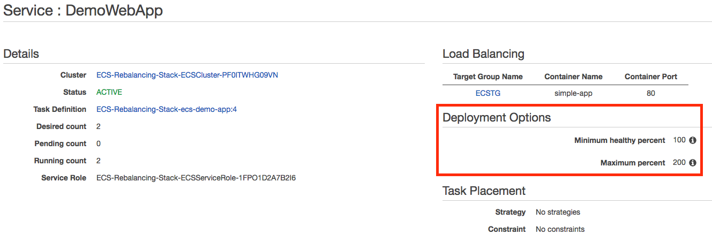
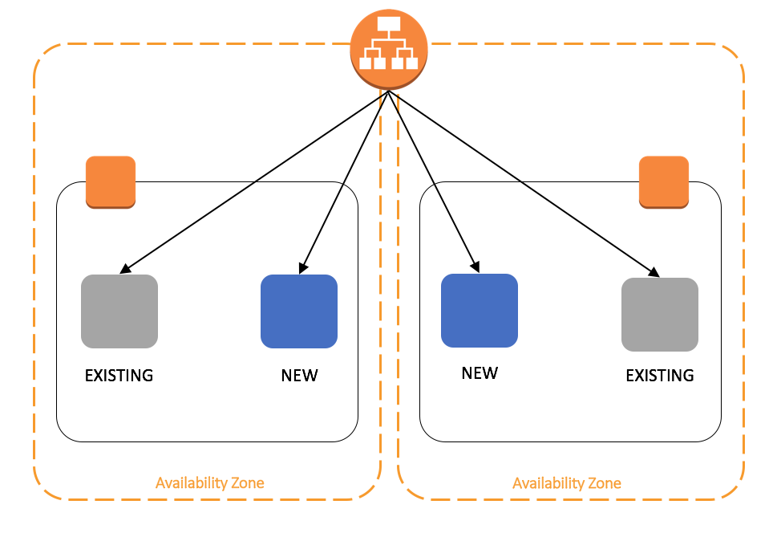

# Rebalancing Amazon ECS Tasks using AWS Lambda

1. [Introduction](#intro)
2. [Create an ECS Cluster and Deploy a Sample App](#create)
3. [Use ECS Events to Rebalance Tasks](#rebalance)
4. [Clean Up](#cleanup)


## Introduction 

Containerization offers many benefits to modern microservices architectures. [Amazon EC2 Container Service](https://aws.amazon.com/ecs/) (ECS) allows you to easily run Docker Containers on a managed cluster of Amazon EC2 instances. As an organization grows in maturity, cost optimizations such as Auto-Scaling and deployment methodologies such as Blue/Green can create a lot of churn in the environment. 

Consider an ECS cluster with tasks distributed evenly across multiple ECS instances within the cluster.  If the cluster is scaled down in order to save cost, the tasks on the removed instance are assigned to remaining nodes automatically. However, when the ECS cluster is scaled up again, tasks are not automatically redistributed across all available instances.  This leads to unused capacity and an under-utilized cluster, which could negatively affect application availibility.

In this reference architecture, we will demonstrate a serverless approach using [AWS Lambda](https://aws.amazon.com/ecs/) and Amazon ECS Event Stream to proactively rebalance the ECS tasks.


## Create an ECS Cluster and Deploy a Sample App

For your convenience, we have created a CloudFormation template that will create the core infrastructure that we will use throughout this example. The template creates an Application Load Balancer (ALB), an ECS Cluster containing two m3.medium instances running the ECS Optimized AMI, and a task definition for a small web application. An S3 bucket is also created to host our lambda function.

### Let's Get Started

*	Create a new Stack from the AWS Console use the following template URL: <https://github.com/awslabs/ecs-refarch-task-rebalancing/blob/master/ecs-cluster-setup.yaml>.
* Confirm that the stack creates successfully. Under the Outputs tab, you’ll find an S# bucket listed. Note this down as you will use it later to upload your zipped Lambda Function.
* You’ll also find the Application URL listed as ECSALB. Cut and paste this into your browser. 

	**You should see a Congratulations page confirming that your ECS Service is running as expected.**
	


### Explore the ECS Cluster

* Review the configuration in the ECS Console. You should see two ECS Instances and two running tasks. One task should be running on each.

	

*  Scale Down the ECS Cluster Size to **1** using the desired count in the Auto Scaling Group Settings.

	

* Verify that the Site has remained up and both tasks are running on a single node.

	

*	Change the ASG desired count back to **2**.
*	Observe that a new instance is created, but tasks did not balance across both nodes. This is the default behavior of ECS.

	


## Use ECS Events to Rebalance Tasks

We propose a solution that listens to “ECS Container Instance State Change” events on the ECS event stream and triggers a lambda that rebalances tasks on the ECS cluster. 



This involves:

* Creating a Lambda function that will rebalance tasks on ECS cluster by updating the service deployed on the cluster.  
* 	Creating a Cloud Watch Event, that uses “ECS Container Instance. State Change” event from the ECS event stream as a trigger to execute the lambda function that rebalances the tasks.

### Explore the Lambda Function

The code for our lambda function is `ecs-task-rebalancer.py` and can be found at <https://github.com/awslabs/ecs-refarch-task-rebalancing/blob/master/ecs-task-rebalancer.py>. 

Let's take a look at what this script it doing in more detail. The Lambda function will be triggered by a specific CloudWatch Event from ECS. Details of the trigger are below.

	{
		"detail-type": [
  			"ECS Container Instance State Change"
		],
  		"source": [
  			"aws.ecs"
		],
		"detail": {
			"clusterArn": [
				"arn:aws:ecs:us-west-2:<AWS ACCOUNT NUMBER>:cluster/ECS-				Rebalancing-Stack-ECSCluster"
       	]
      }
    }
 Once the Lambda function has been triggered, it evaluates the event details to determine whether a rebalancing action is required. 
 	
~~~python
##Describe the container instance that caused the event.
    response = ecs.describe_container_instances(
        cluster=cluster_name,
        containerInstances=[containerInstanceArn]
    )

    containerInstances = response["containerInstances"]
    print "Number of container instances", len(containerInstances)
    if(len(containerInstances) != 0):
        containerInstance = containerInstances[0]
        numberOfRunningTasks = containerInstance["runningTasksCount"]
        numberOfPendingTasks = containerInstance["pendingTasksCount"]
        version = containerInstance["version"]

        if numberOfRunningTasks == 0 and numberOfPendingTasks == 0 and agentConnected == True:
            print ("Rebalancing the tasks due to the event.")
            rebalance_tasks()
        else :
            print ("Event does not warrant task rebalancing.")
~~~ 

If the ECS Agent is connected, but there are no running or pending tasks, then a new instance has joined the cluster and is ready to receive tasks. The script will iterate through all running services and create a new copy of the existing task definition. This will redeploy the service according to the configured placement strategy.

~~~python
#Rebalance ECS tasks of all services deployed in the cluster
    def rebalance_tasks():
        all_services = get_cluster_services()

        #For each service, figure out the taskDefinition, register a new version
        #and update the service -- This sequence will rebalance the tasks on all
        #available and connected instances
        response = ecs.describe_services(
            cluster=cluster_name,
            services=all_services
        )

        described_services = response["services"]
        for service in described_services:

            print ("service : ", service)

            #Get information about the task definition of the service
            task_definition = service["taskDefinition"];

            response = ecs.describe_task_definition(
                taskDefinition=task_definition
            )

            taskDefinitionDescription = response["taskDefinition"]

            containerDefinitions = taskDefinitionDescription["containerDefinitions"]
            volumes = taskDefinitionDescription["volumes"]
            family = taskDefinitionDescription["family"]

            print ("containerDefinitions : ", containerDefinitions)
            print ("volumes : ", volumes)
            print ("family : ", family)

            #Register a new version of the task_definition
            response = ecs.register_task_definition(
                family=family,
                containerDefinitions=containerDefinitions,
                volumes= volumes
            )

            newTaskDefinitionArn = response["taskDefinition"]["taskDefinitionArn"]
            print "New task definition arn : " , newTaskDefinitionArn

            response = ecs.update_service(
                cluster=cluster_name,
                service=service["serviceArn"],
                taskDefinition=newTaskDefinitionArn
            )

            print ("Updated the service ", service, "with new task definition")
~~~

The service performs an In-Place Deployment. Two new tasks are started growing the number of tasks to 200% of its desired count which is the maximum permitted.



After the new tasks are verified to be healthy by the Elastic Load Balancer health check, the two previous tasks with the older task definition are drained and stopped.



Now that we understand what the function is doing, let's deploy it!

### Deploy the Lambda Function
 
* Download the `ecs-task-rebalancer.py` script from the repo or recreate it locally.
* Zip up the python script.
	`zip ecs-task-rebalancer.zip ecs-task-rebalancer.py`
* Upload the zip file to the S3 bucket created by the CloudFormation template using the Console or AWS CLI.
	`aws s3 cp ecs-task-rebalancer.zip s3://<BUCKET_NAME>`
* A second CloudFormation template has been provided to configure the Lambda Function and CloudWatch Triggers. Create a new stack using the following template: <https://github.com/awslabs/ecs-refarch-task-rebalancing/blob/master/ecs-task-rebalancer.json>
* Confirm that the stack is created successfully.

### Scale the Cluster and Validate Task Rebalancing

* Scale Down the ECS Cluster Size to **1** using the desired count in the Auto Scaling Group Settings.
* Verify that the Site has remained up and both tasks are running on a single node.
* In the AWS Lambda console, confirm that your lambda function has been triggered and show no invocations.

	

* In the CloudWatch Console, you'll see a log group named after your CloudFormation Stack. You'll see the output of the lambda function, but see that tasks did not require rebalancing.

	
	
*	We will now scale the cluster back up. Change the ASG desired count back to **2**.
*	In the ECS console, you'll see that the second instance has been restored and the tasks have been balanced across both nodes.

	

* Review the CloudWatch logs. You'll see that a new task definition version was created causing the tasks to be rebalanced across all available nodes.

	
	
*Disclaimer: This solution works by creating new versions of the task definitions to trigger the rebalancing. This may impact applications with long lived connections. This will also create new task definition versions which are not deleted. Please test the solution with your application to ensure it will function as expected.*	
	
	
## Clean Up

Now we will clean up the resources that we created to avoid being charged. CloudFormation cannot delete an bucket that is not empty.  We will delete the lambda function zip file from the S3 bucket. Next, delete the lambda function CloudFormation stack that we created, this will delete the lambda functions. Next delete the ecs cluster stack. This should delete all the resources that were created for this exercise

### Conclusion
We have explored using the ECS event stream to proactively rebalance ECS tasks. If you'd like to dive deeper into any of these topics, please check out the following links:

[Monitor Cluster State with Amazon ECS Event Stream](https://aws.amazon.com/blogs/compute/monitor-cluster-state-with-amazon-ecs-event-stream/)

[ECS Reference Architecture: Continuous Deployment](https://github.com/awslabs/ecs-refarch-continuous-deployment)

[Blue/Green deployments on ECS](https://github.com/awslabs/ecs-blue-green-deployment) 



